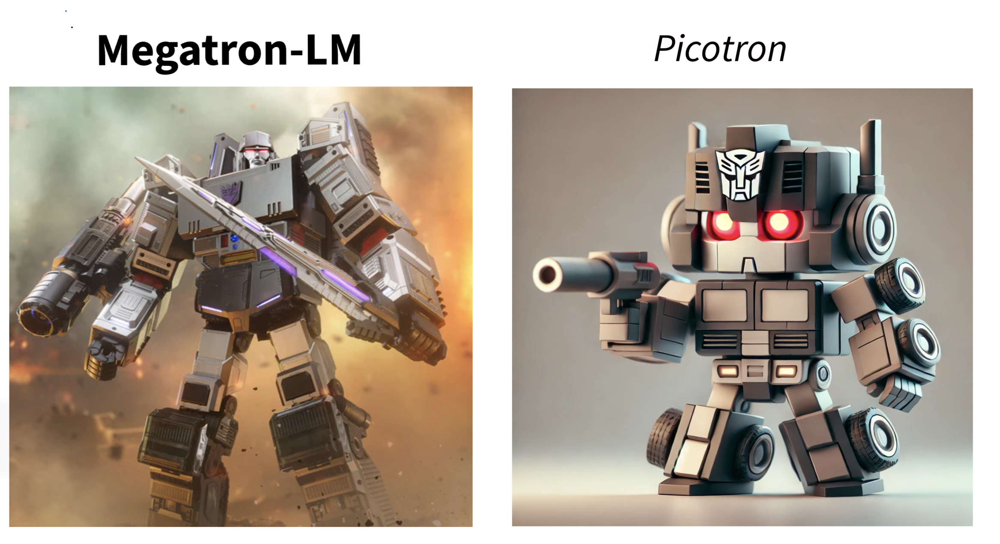

# picotron
In the spirit of [NanoGPT](https://github.com/karpathy/nanoGPT), we created Picotron: The minimalist & most-hackable repository for pre-training Llama-like models with [4D Parallelism](https://arxiv.org/abs/2407.21783) (Data, Tensor, Pipeline, Context parallel). It is designed with simplicity and **educational** purposes in mind, making it an excellent tool for learning and experimentation.


- The code itself is simple and readable: train.py, model.py and \[data|tensor|pipeline|context\]_parallel.py are all under **300** lines of code.

- Performance is not the best but okay-ish, and still under active development. We observed 38% MFU on a LLaMA-2-7B model using 64 H100 GPUs and nearly 50% MFU on the SmolLM-1.7B model with 8 H100 GPUs.

# Install

```
pip install -e .
```

# Quick start
- Get a HF token [here](https://huggingface.co/settings/tokens) to download models from HuggingFace

- GPU
    ```sh
    # To create a config file in json format under tmp by default
    python create_config.py --out_dir tmp --exp_name llama-1B --dp 8 --model_name HuggingFaceTB/SmolLM-1.7B --num_hidden_layers 15  --grad_acc_steps 32 --mbs 4 --seq_len 1024 --hf_token <HF_TOKEN>

    # Locally
    torchrun --nproc_per_node 8 train.py --config tmp/llama-1B/config.json 

    # 3D Parallelism
    python create_config.py --out_dir tmp --dp 4 --tp 2 --pp 2 --pp_engine 1f1b --exp_name llama-7B --model_name meta-llama/Llama-2-7b-hf  --grad_acc_steps 32 --mbs 4 --seq_len 1024 --hf_token <HF_TOKEN>

    # Slurm
    python submit_slurm_jobs.py --inp_dir tmp/llama-7B --qos high --hf_token <HF_TOKEN>
    ```

-  CPU (expect it to be slow)
    ```sh
    # 3D Parallelism on CPU
    python create_config.py --out_dir tmp --exp_name llama-1B-cpu --dp 2 --tp 2 --pp 2 --pp_engine 1f1b --model_name HuggingFaceTB/SmolLM-1.7B --num_hidden_layers 5  --grad_acc_steps 2 --mbs 4 --seq_len 128 --hf_token <HF_TOKEN> --use_cpu

    # Locally
    torchrun --nproc_per_node 8 train.py --config tmp/llama-1B-cpu/config.json
    ```

# Acknowledgements

- [Megatron-LM](https://github.com/NVIDIA/Megatron-LM)
- [FairScale](https://github.com/facebookresearch/fairscale)
- [LitGPT](https://github.com/Lightning-AI/lit-gpt)